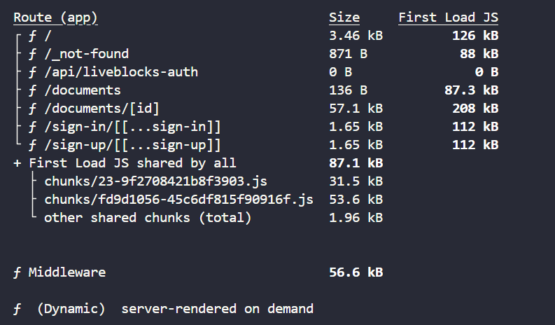

ƒ (Dynamic Server-Side Rendered - SSR) trang động:

Trang sẽ được "render" động trên máy chủ mỗi khi có yêu cầu từ người dùng.
Mỗi lần người dùng yêu cầu trang này, nó sẽ được "render" lại trên máy chủ và sau đó gửi về trình duyệt.

○ (Static HTML) trang :
Trang đã được render sẵn thành một file HTML tĩnh trong quá trình build.
Những trang này không có bất kỳ dữ liệu động nào từ máy chủ khi được yêu cầu. Chúng có thể được phân phối trực tiếp từ CDN mà không cần xử lý trên máy chủ.

